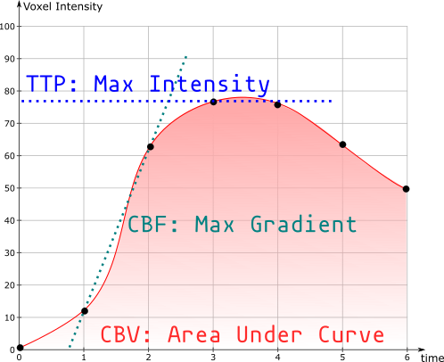
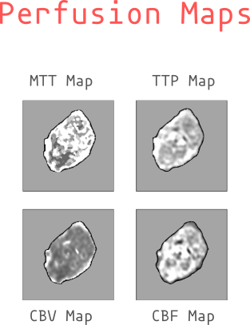
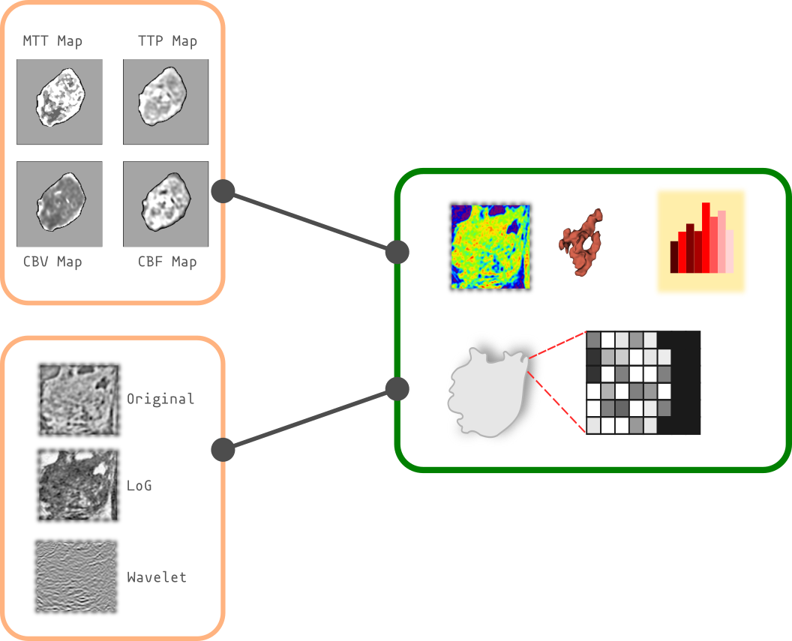
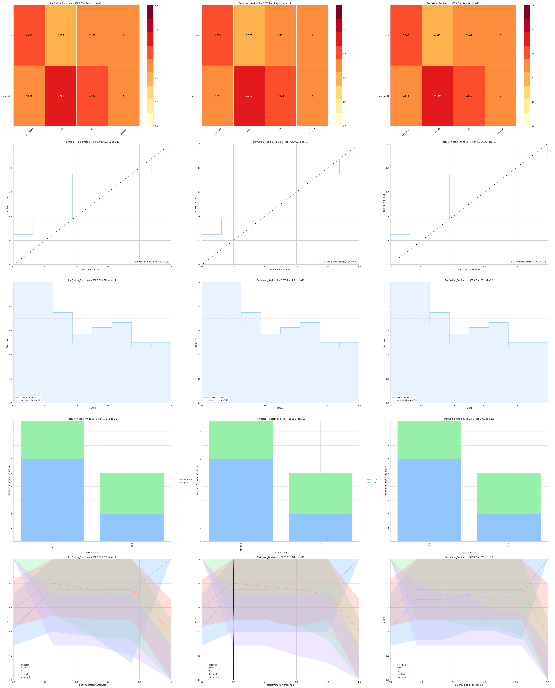

# Hive-ML

**Hive-ML** is a Python Package collecting the tools and scripts to run Machine Learning experiments on Radiological
Medical Imaging.

## Install

To install Hive-ML:

```shell
pip install hive-ml
```

or from GitHub:

```shell
git clone 
pip install -e Hive_ML
```

## Description

The **Hive-ML** workflow consists of several sequential steps, including *Radiomics extraction*,
*Sequential Forward Feature Selection*, and *Model Fitting*, reporting the classifier performances ( *ROC-AUC*,
*Sensitivity*,
*Specificity*, *Accuracy*) in a tabular format and tracking all the steps on an **MLFlow** server.

In addition, **Hive-ML** provides a *Docker Image*, *Kubernetes Deployment* and *Slurm Job*,
with the corresponding set of instructions to easily reproduce the experiments.

Finally, **Hive-ML** also support model serving through **MLFlow**, to provide easy access to the trained classifier
for future usage in model prediction.

#In the tutorial explained below, Hive-ML is used to predict the Pathological Complete Response after a Neo-Adjuvant
#chemotherapy, from DCE-MRI.

## Usage


The Hive-ML workflow is controlled from a JSON configuration file, which the user can customize for each experiment run.

Example:

```json
    {
      "image_suffix": "_image.nii.gz",  # File suffix (or list of File suffixes) of the files containing the image volume.
      "mask_suffix": "_mask.nii.gz",    # File suffix (including file extension) of the files containing the segmentation mask of the ROI.
      "label_dict": {                   # Dictionary describing the classes. The key-value pair contains the label value as key (starting from 0) and the class description as value.
        "0": "non-pCR",
        "1": "pCR"
      },
      "models": {                       # Dictionary for all the classifiers to evaluate. Each element includes the classifier class name and an additional dictionary with the kwargs to pass to the classifier object.
        "rf": {
          "criterion": "gini",
          "n_estimators": 100,
          "max_depth": 10
        },
        "adab": {
          "criterion": "gini",
          "n_estimators": 100,
          "max_depth": 10
        },
        "knn": {},
        "lda": {},
        "qda": {},
        "logistic_regression": {},
        "svm": {
          "kernel": "rbf"
        },
        "naive": {}
      },
      "perfusion_maps": {                # Dictionary describing the perfusion maps to extract. Each element includes the perfusion map name and the file suffix used to save the perfusion map.
        "distance_map": "_distance_map.nii.gz",
        "distance_map_depth": {
          "suffix": "_distance_map_depth.nii.gz",
          "kwargs": [
            2
          ]
        },
        "ttp": "_ttp_map.nii.gz",
        "cbv": "_cbv_map.nii.gz",
        "cbf": "_cbf_map.nii.gz",
        "mtt": "_mtt_map.nii.gz"
     },
      "feature_selection": "SFFS",       # Type of Feature Selection to perform. Supported values are SFFS and PCA .
      "n_features": 30,                  # Number of features to preserve when performing Feature Selection.
      "n_folds": 5,                      # Number of folds to run cross-validation.
      "random_seed": 12345,              # Random seed number used when randomizing events and actions.
      "feature_aggregator": "SD"         # Aggregation strategy used when extracting features in the 4D. 
                                         # Supported values are: ``Flat`` (no aggregation, all features are preserved),
                                         #                       ``Mean`` (Average over the 4-th dimension),
                                         #                        ``SD`` (Standard Deviation over the 4-th dimension),
                                         #                        ``Mean_Norm`` (Independent channel-normalization, followed by average over the 4-th dimension),
                                         #                        ``SD_Norm`` (Independent channel-normalization, followed by SD over the 4-th dimension)
      "k_ensemble": [1,5],               # List of k values to select top-k best models in ensembling.
      "metric_best_model": "roc_auc",    # Classification Metric to consider when determining the best models from CV results.
      "reduction_best_model": "mean"     # Reduction to perform on CV scores to determine the best models.
    }
```

### Perfusion Maps Generation

Given a 4D Volume, to extract the perfusion maps (``TTP``, ``CBV``, ``CBF``, ``MTT``) run:

```shell
 Hive_ML_generate_perfusion_maps -i </path/to/data_folder> --config-file <config_file.json>
```

Fore more details, follow the Jupyter Notebook
Tutorial : [Generate Perfusion Maps](tutorials/0-Generate_Perfusion_Maps.ipynb)




### Feature Extraction

To extract Radiomics/Radiodynamics from the 4D Volume, run:

```shell
 Hive_ML_extract_radiomics --data-folder </path/to/data_folder> --config-file <config_file.json> --feature-param-file </path/to/radiomics_config.yaml --output-file </path/to/feature_file> 
```



Fore more details, follow the Jupyter Notebook Tutorial : [Extract Features](tutorials/1-Extract_Features.ipynb)

### Feature Selection

To run Feature Selection:

```shell
 Hive_ML_feature_selection --feature-file </path/to/feature_file> --config-file <config_file.json> --experiment-name <EXPERIMENT_ID>
```

The Feature Selection report (in JSON format, including the selected features and validation scores for each classifier)
will be available at the following path:

```
$ROOT_FOLDER/<EXPERIMENT_ID>/SFFS
```


Fore more details, follow the Jupyter Notebook Tutorial : [Feature Selection](tutorials/2-Feature_Selection.ipynb)

### Model Fitting

To perform Model Fitting on the Selected features:

```shell
 Hive_ML_model_fitting --feature-file </path/to/feature_file> --config-file <config_file.json> --experiment-name <EXPERIMENT_ID>
```

The experiment validation reports, plots, and summaries will be available at the following path:

```
$ROOT_FOLDER/<EXPERIMENT_ID>
```




Fore more details, follow the Jupyter Notebook Tutorial : [Model Fitting](tutorials/3-Model_Fitting.ipynb)
